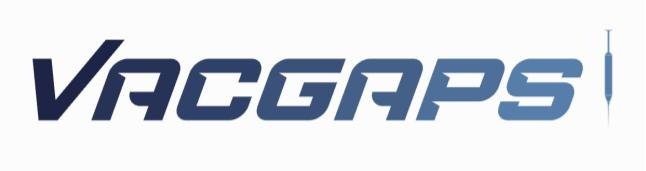

# Vacgaps

This project was generated using [Nx](https://nx.dev).

🔎 **Nx is a set of Extensible Dev Tools for Monorepos.**

## Local setup

1. Clone the repo
2. Run `yarn install`
3. In order to run in dev mode run `yarn start`
4. In order to test run `yarn test` or `yarn test --watch` for dev mode
5. You can build the project by running `yarn build --prod` which will output the bundled project to the dist folder

Enjoy!

## Generate an application

Run `yarn nx g @nrwl/angular:app my-app` to generate an application.

When using Nx, you can create multiple applications and libraries in the same workspace.

## Generate a library

Run `yarn nx g @nrwl/angular:lib my-lib` to generate a library.

Libraries are sharable across libraries and applications. They can be imported from `@vacgaps/mylib`.

## Development server

Run `yarn nx serve my-app` for a dev server. Navigate to http://localhost:4200/. The app will automatically reload if you change any of the source files.

## Code scaffolding

Run `yarn nx g @nrwl/angular:component my-component --project=my-app` to generate a new component.

## Build

Run `yarn nx build my-app` to build the project. The build artifacts will be stored in the `dist/` directory. Use the `--prod` flag for a production build.

## Running unit tests

Run `yarn nx test my-app` to execute the unit tests via [Jest](https://jestjs.io).

Run `yarn nx affected:test` to execute the unit tests affected by a change.

## Running end-to-end tests

Run `ng e2e my-app` to execute the end-to-end tests via [Cypress](https://www.cypress.io).

Run `yarn nx affected:e2e` to execute the end-to-end tests affected by a change.

## Understand your workspace

Run `yarn nx dep-graph` to see a diagram of the dependencies of your projects.

## Further help

Visit the [Nx Documentation](https://nx.dev) to learn more.
